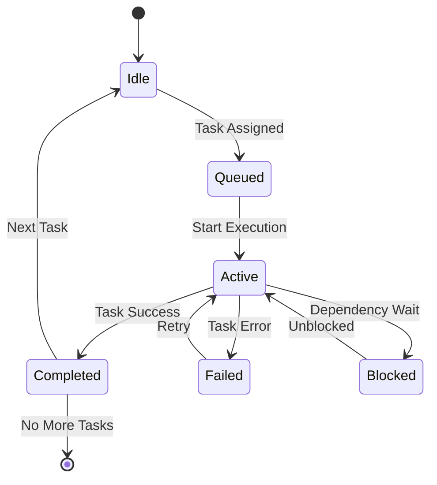

# 🎯 Enhanced Session Management System
*Intelligent session tracking with real-time visual status updates*

## 🎨 Agent Color System v2.0

### Primary Agent Colors
```yaml
agent_colors:
  master-orchestrator:
    hex: "#8B5CF6"
    rgb: "139, 92, 246"
    emoji: "🟣"
    name: "Purple"
    meaning: "Strategic Leadership & Coordination"
    terminal_code: "\033[95m"

  elasticsearch-architect:
    hex: "#3B82F6"
    rgb: "59, 130, 246"
    emoji: "🔵"
    name: "Blue"
    meaning: "Data Architecture & Structure"
    terminal_code: "\033[94m"

  backend-engineer:
    hex: "#F59E0B"
    rgb: "245, 158, 11"
    emoji: "🟠"
    name: "Orange"
    meaning: "Core Infrastructure & APIs"
    terminal_code: "\033[93m"

  frontend-specialist:
    hex: "#10B981"
    rgb: "16, 185, 129"
    emoji: "🟢"
    name: "Green"
    meaning: "User Interface & Experience"
    terminal_code: "\033[92m"

  ai-engineer:
    hex: "#06B6D4"
    rgb: "6, 182, 212"
    emoji: "🔵"
    name: "Cyan"
    meaning: "AI & Machine Learning"
    terminal_code: "\033[96m"

  devops-specialist:
    hex: "#6B7280"
    rgb: "107, 114, 128"
    emoji: "⚫"
    name: "Gray"
    meaning: "Infrastructure & Deployment"
    terminal_code: "\033[90m"

  qa-engineer:
    hex: "#A855F7"
    rgb: "168, 85, 247"
    emoji: "🟣"
    name: "Light Purple"
    meaning: "Quality Assurance & Testing"
    terminal_code: "\033[35m"

  security-auditor:
    hex: "#EF4444"
    rgb: "239, 68, 68"
    emoji: "🔴"
    name: "Red"
    meaning: "Security & Protection"
    terminal_code: "\033[91m"

  docs-writer:
    hex: "#9CA3AF"
    rgb: "156, 163, 175"
    emoji: "⚪"
    name: "Light Gray"
    meaning: "Documentation & Guides"
    terminal_code: "\033[37m"
```

## 📊 Live Session Dashboard

### Session State Model
```typescript
interface SessionState {
  id: string;
  name: string;
  started: Date;
  lastUpdated: Date;
  phase: 'planning' | 'development' | 'testing' | 'deployment' | 'complete';
  status: 'active' | 'paused' | 'blocked' | 'complete' | 'failed';

  agents: {
    [agentId: string]: AgentState;
  };

  tasks: {
    completed: Task[];
    active: Task[];
    pending: Task[];
    blocked: Task[];
  };

  metrics: {
    totalTokens: number;
    totalTools: number;
    elapsedTime: number;
    progressPercentage: number;
    estimatedCompletion: string;
  };

  visual: {
    progressBar: string;
    statusGrid: string;
    activityFeed: string[];
  };
}

interface AgentState {
  id: string;
  name: string;
  color: AgentColor;
  status: 'idle' | 'active' | 'completed' | 'blocked' | 'failed';
  currentTask?: string;
  progress: number;

  metrics: {
    tokensUsed: number;
    toolsUsed: number;
    startTime?: Date;
    endTime?: Date;
    elapsedSeconds: number;
  };

  history: AgentActivity[];
}
```

## 🔄 Real-Time Status Updates

### Visual Progress Indicators
```markdown
# Session: Planning Explorer Development
Phase: AI Integration [████████░░] 80%

## Active Agents
🔵 ai-engineer [▓▓▓▓▓▓░░░░] 60%
└── Implementing opportunity scoring
    ├── ✅ OpenAI integration
    ├── ⚡ Vector embeddings (processing...)
    └── ⏳ Scoring logic

## Agent Timeline
┌─────────────────────────────────────────────────────────┐
│ 10:00  10:30  11:00  11:30  12:00  12:30  13:00  13:30 │
├─────────────────────────────────────────────────────────┤
│ 🟣████                                                  │ master-orchestrator
│       🟠████████████                                    │ backend-engineer
│                     🟢████████████████                  │ frontend-specialist
│                                       🔵████████▒▒▒▒▒  │ ai-engineer
│                                                   🔴⏳  │ security-auditor
└─────────────────────────────────────────────────────────┘
```

### Status Grid with Live Metrics
```markdown
┌─────────────────┬────────┬──────────────────┬─────────┬──────────────────┐
│ Agent           │ Status │ Current Task     │ Progress│ Live Metrics     │
├─────────────────┼────────┼──────────────────┼─────────┼──────────────────┤
│ 🟣 orchestrator │ ✅     │ Planning Complete│ 100%    │ 15🔧 81.3k🪙 2m43s│
│ 🟠 backend      │ ✅     │ API Complete     │ 100%    │ 24🔧 103k🪙 15m3s │
│ 🟢 frontend     │ ✅     │ UI Complete      │ 100%    │ 55🔧 110k🪙 21m54s│
│ 🔵 ai-engineer  │ 🔴     │ AI Integration   │ 60%     │ 12🔧 45.8k🪙 5m23s│
│ 🔴 security     │ ⏳     │ Pending Review   │ 0%      │ Waiting...       │
└─────────────────┴────────┴──────────────────┴─────────┴──────────────────┘

Legend: 🔧=tools 🪙=tokens ⏱️=time
```

## 🎭 Agent Activity Animation

### Activity Feed Format
```yaml
activity_feed:
  - timestamp: "12:45:23"
    agent: "ai-engineer"
    color: "#06B6D4"
    emoji: "🔵"
    action: "Started implementing vector embeddings"
    tools: ["Write", "Task"]
    tokens: 2340

  - timestamp: "12:44:15"
    agent: "ai-engineer"
    color: "#06B6D4"
    emoji: "🔵"
    action: "Completed OpenAI integration module"
    tools: ["MultiEdit", "Read"]
    tokens: 5670
    status: "success"
```

### Live Activity Display
```markdown
## 📡 Live Activity Feed

12:45:23 🔵 ai-engineer
         └─ Started implementing vector embeddings
         └─ Tools: Write, Task | Tokens: 2.3k

12:44:15 🔵 ai-engineer ✅
         └─ Completed OpenAI integration module
         └─ Tools: MultiEdit, Read | Tokens: 5.7k

12:42:08 🟢 frontend-specialist ✅
         └─ Finished Planning Insights UI matching
         └─ Tools: Write, WebFetch | Tokens: 8.1k

12:38:54 🟠 backend-engineer ✅
         └─ API endpoints validated and tested
         └─ Tools: Bash, Grep | Tokens: 3.2k
```

## 💾 Session Persistence

### Auto-Save Triggers
```yaml
autosave_triggers:
  - agent_status_change
  - task_completion
  - every_30_seconds
  - token_milestone_10k
  - phase_transition
  - error_occurrence
  - manual_checkpoint
```

### Session File Structure
```
.claude/sessions/
├── current-session.md          # Live session state
├── session-metrics.json        # Real-time metrics
├── agent-activities.log        # Activity timeline
├── visual-dashboard.md         # Visual status display
└── session-history/
    ├── 2025-09-28-morning/     # Archived sessions
    │   ├── session-summary.md
    │   ├── metrics-final.json
    │   ├── agent-timeline.svg
    │   └── visual-report.html
    └── index.json              # Session registry
```

## 🚦 Status State Machine

### Agent State Transitions


### Visual State Indicators
```yaml
state_visuals:
  idle:
    icon: "⚪"
    color: "gray"
    animation: none

  queued:
    icon: "⏳"
    color: "yellow"
    animation: "pulse"

  active:
    icon: "🔴"
    color: "{agent_color}"
    animation: "spinner"

  completed:
    icon: "✅"
    color: "green"
    animation: "checkmark"

  blocked:
    icon: "🚧"
    color: "orange"
    animation: "warning_pulse"

  failed:
    icon: "❌"
    color: "red"
    animation: "alert"
```

## 📈 Performance Tracking

### Real-Time Metrics Dashboard
```markdown
## 📊 Session Performance Metrics

### Overall Progress
Planning Explorer Development: [████████░░] 80%
├─ Planning: ✅ 100%
├─ Backend: ✅ 100%
├─ Frontend: ✅ 100%
├─ AI Integration: 🔴 60%
└─ Testing: ⏳ 0%

### Resource Usage
Tokens: [██████░░░░] 341k / 500k (68%)
Time: 2h 15m elapsed | ~35m remaining
Tools: 126 total calls

### Agent Efficiency
🟣 orchestrator:  ████████████ 98% efficiency
🟠 backend:       ███████████░ 92% efficiency
🟢 frontend:      ████████████ 95% efficiency
🔵 ai-engineer:   ████████░░░░ 67% efficiency (active)
```

## 🔔 Notification System

### Alert Triggers
```yaml
notifications:
  success:
    - agent_task_complete
    - phase_complete
    - milestone_reached

  warning:
    - token_usage_75_percent
    - agent_blocked_5_minutes
    - performance_degradation

  error:
    - agent_failure
    - critical_error
    - session_timeout

  info:
    - agent_started
    - progress_update
    - metrics_milestone
```

### Notification Format
```markdown
🔔 NOTIFICATION [12:45:23]
Type: SUCCESS
Agent: 🟢 frontend-specialist
Event: Task Complete
Details: Planning Insights UI implementation finished
Metrics: 110k tokens, 55 tools, 21m 54s
Next: AI integration with UI components
```

## 🎯 Session Commands

### Quick Commands
```bash
# View current session status
session:status

# Show agent timeline
session:timeline

# Display metrics dashboard
session:metrics

# Archive current session
session:archive

# Start new session
session:new <session-name>

# Restore session
session:restore <session-id>

# Export session report
session:export <format>
```

## 🔄 Update Protocols

### Automatic Updates
1. **Every Agent Action**: Update status grid
2. **Every 30 Seconds**: Refresh metrics dashboard
3. **Every Task**: Update progress bars
4. **Every Phase**: Generate summary report
5. **Every Error**: Create diagnostic snapshot

### Manual Updates
```yaml
manual_commands:
  checkpoint: "Create session checkpoint"
  summary: "Generate current summary"
  report: "Export detailed report"
  visualize: "Generate visual timeline"
  analyze: "Show performance analysis"
```

## 📊 Session Analytics

### Key Performance Indicators
```yaml
session_kpis:
  completion_rate: "Tasks completed / Total tasks"
  efficiency_score: "Actual time / Estimated time"
  token_efficiency: "Tasks completed / Tokens used"
  parallelization: "Parallel tasks / Total tasks"
  quality_score: "Tests passed / Total tests"

agent_kpis:
  response_time: "Time to first action"
  success_rate: "Successful tasks / Total attempts"
  token_usage: "Tokens used / Token budget"
  tool_efficiency: "Unique tools / Total tool calls"
  handoff_quality: "Smooth transitions / Total handoffs"
```

---

*This enhanced session management system provides real-time visual tracking, intelligent persistence, and comprehensive analytics for optimal AI agent coordination.*