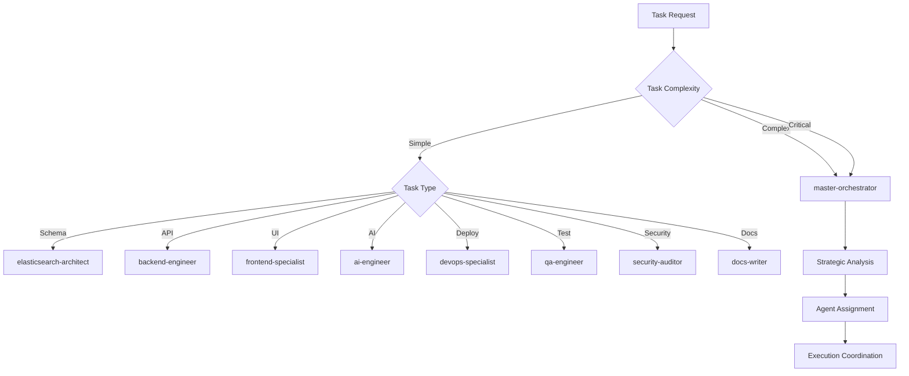

# 🧠 Decision Flow Patterns
*Intelligent Agent Selection and Workflow Adaptation*

## 🎯 Decision Trees for Agent Selection

### Primary Decision Matrix


### Task Classification Decision Tree
```yaml
Task_Classification:
  complexity_assessment:
    simple:
      criteria:
        - single_component_change
        - well_defined_scope
        - no_dependencies
        - standard_patterns
      examples:
        - "Add new API endpoint"
        - "Update component styling"
        - "Fix unit test"
        - "Update documentation"

    medium:
      criteria:
        - multiple_component_interaction
        - some_dependencies
        - requires_coordination
        - custom_implementation
      examples:
        - "Implement new search feature"
        - "Add authentication to module"
        - "Create new page with components"
        - "Setup monitoring dashboard"

    complex:
      criteria:
        - cross_system_changes
        - multiple_agent_coordination
        - architectural_impact
        - integration_requirements
      examples:
        - "Implement complete AI pipeline"
        - "Build end-to-end feature"
        - "Performance optimization project"
        - "Security compliance implementation"

    critical:
      criteria:
        - production_impact
        - security_implications
        - data_integrity_risk
        - compliance_requirements
      examples:
        - "Production deployment"
        - "Security vulnerability fix"
        - "Data migration"
        - "GDPR compliance implementation"
```

## 🔄 Dynamic Workflow Selection

### Workflow Decision Engine
```python
class WorkflowDecisionEngine:
    def __init__(self):
        self.agents = self._load_agent_capabilities()
        self.patterns = self._load_workflow_patterns()

    def select_workflow(self, task_request):
        """Intelligent workflow selection based on task characteristics"""

        # Analyze task complexity
        complexity = self._assess_complexity(task_request)

        # Determine optimal execution pattern
        if complexity == "simple":
            return self._single_agent_workflow(task_request)
        elif complexity == "medium":
            return self._sequential_workflow(task_request)
        elif complexity == "complex":
            return self._parallel_workflow(task_request)
        else:  # critical
            return self._orchestrated_workflow(task_request)

    def _assess_complexity(self, task_request):
        """Analyze task to determine complexity level"""
        factors = {
            'components_affected': self._count_components(task_request),
            'dependencies': self._analyze_dependencies(task_request),
            'risk_level': self._assess_risk(task_request),
            'time_sensitivity': self._check_urgency(task_request),
            'integration_points': self._count_integrations(task_request)
        }

        return self._calculate_complexity_score(factors)

    def _single_agent_workflow(self, task_request):
        """Simple tasks handled by single specialist"""
        agent = self._select_primary_agent(task_request)

        return {
            'pattern': 'single_agent',
            'agents': [agent],
            'execution': 'direct',
            'coordination': 'minimal',
            'duration': 'short'
        }

    def _sequential_workflow(self, task_request):
        """Medium complexity tasks with sequential steps"""
        agents = self._select_agent_sequence(task_request)

        return {
            'pattern': 'sequential',
            'agents': agents,
            'execution': 'step_by_step',
            'coordination': 'handoff_based',
            'duration': 'medium'
        }

    def _parallel_workflow(self, task_request):
        """Complex tasks with parallel execution"""
        agent_groups = self._select_parallel_groups(task_request)

        return {
            'pattern': 'parallel',
            'agents': agent_groups,
            'execution': 'concurrent',
            'coordination': 'synchronized',
            'duration': 'optimized'
        }

    def _orchestrated_workflow(self, task_request):
        """Critical tasks requiring full orchestration"""
        return {
            'pattern': 'orchestrated',
            'coordinator': 'master-orchestrator',
            'phases': self._define_phases(task_request),
            'execution': 'managed',
            'coordination': 'comprehensive',
            'duration': 'planned'
        }
```

### Agent Selection Algorithms

#### Capability-Based Selection
```yaml
Agent_Selection_Criteria:
  elasticsearch-architect:
    primary_capabilities:
      - schema_design
      - index_optimization
      - vector_search_setup
      - aggregation_queries
    selection_triggers:
      - task_mentions: ["elasticsearch", "schema", "mapping", "index"]
      - data_operations: ["search", "aggregation", "vector"]
      - performance_needs: ["query_optimization", "scaling"]

  backend-engineer:
    primary_capabilities:
      - api_development
      - database_integration
      - authentication
      - business_logic
    selection_triggers:
      - task_mentions: ["api", "endpoint", "fastapi", "supabase"]
      - functionality: ["crud", "authentication", "business_logic"]
      - integration: ["database", "third_party_apis"]

  frontend-specialist:
    primary_capabilities:
      - shadcn_ui_components
      - user_experience
      - responsive_design
      - state_management
      - type_safe_forms
      - accessibility_compliance
    selection_triggers:
      - task_mentions: ["ui", "frontend", "component", "nextjs", "shadcn", "form"]
      - design_needs: ["responsive", "styling", "interaction", "accessibility"]
      - user_interface: ["forms", "navigation", "display", "validation"]
      - component_needs: ["variants", "composable", "reusable"]

  ai-engineer:
    primary_capabilities:
      - llm_integration
      - machine_learning
      - data_processing
      - model_optimization
    selection_triggers:
      - task_mentions: ["ai", "ml", "llm", "embedding", "scoring"]
      - ai_features: ["summarization", "classification", "prediction"]
      - intelligence: ["natural_language", "automated_analysis"]
```

#### Load Balancing Decision
```python
def select_agent_with_load_balancing(task_request, available_agents):
    """Select agent considering current workload"""

    # Get agents capable of handling the task
    capable_agents = filter_capable_agents(task_request, available_agents)

    # Check current workload
    agent_loads = {
        agent: get_current_workload(agent)
        for agent in capable_agents
    }

    # Consider expertise level
    expertise_scores = {
        agent: calculate_expertise_score(agent, task_request)
        for agent in capable_agents
    }

    # Combined scoring
    selection_scores = {}
    for agent in capable_agents:
        selection_scores[agent] = (
            expertise_scores[agent] * 0.7 +           # Expertise weight
            (1 - agent_loads[agent]) * 0.3            # Availability weight
        )

    # Select highest scoring agent
    return max(selection_scores.items(), key=lambda x: x[1])[0]
```

## 🎯 Context-Aware Decision Making

### Situational Workflow Adaptation
```yaml
Contextual_Decisions:
  production_emergency:
    triggers:
      - security_vulnerability_detected
      - production_system_down
      - data_breach_suspected
    workflow_override:
      pattern: emergency_response
      priority: critical
      agents: [security-auditor, devops-specialist, master-orchestrator]
      execution: immediate_parallel
      approval: bypassed

  development_sprint:
    triggers:
      - sprint_deadline_approaching
      - feature_development_request
      - normal_development_flow
    workflow_selection:
      pattern: based_on_complexity
      priority: normal
      agents: capability_based_selection
      execution: optimized_for_speed
      approval: standard_gates

  quality_focus:
    triggers:
      - pre_release_phase
      - quality_issues_detected
      - comprehensive_testing_needed
    workflow_enhancement:
      pattern: quality_first
      priority: thoroughness
      agents: [qa-engineer, security-auditor, all_specialists]
      execution: comprehensive_validation
      approval: strict_gates

  learning_mode:
    triggers:
      - new_technology_integration
      - experimental_feature
      - proof_of_concept
    workflow_adaptation:
      pattern: exploratory
      priority: learning
      agents: relevant_specialists + master-orchestrator
      execution: iterative_refinement
      approval: flexible_gates
```

### Resource Constraint Decisions
```python
class ResourceConstraintManager:
    def __init__(self):
        self.resource_limits = self._load_resource_config()
        self.current_usage = self._monitor_current_usage()

    def adapt_workflow_for_constraints(self, ideal_workflow, constraints):
        """Adapt workflow based on resource constraints"""

        if constraints.get('token_budget_low'):
            return self._optimize_for_tokens(ideal_workflow)

        if constraints.get('time_pressure'):
            return self._optimize_for_speed(ideal_workflow)

        if constraints.get('agent_availability_limited'):
            return self._optimize_for_availability(ideal_workflow)

        return ideal_workflow

    def _optimize_for_tokens(self, workflow):
        """Reduce token usage while maintaining quality"""
        optimizations = {
            'reduce_context_sharing': True,
            'use_caching_aggressively': True,
            'prefer_simple_agents': True,
            'batch_operations': True
        }
        return self._apply_optimizations(workflow, optimizations)

    def _optimize_for_speed(self, workflow):
        """Maximize speed while maintaining quality"""
        optimizations = {
            'increase_parallelism': True,
            'reduce_quality_gates': 'non_critical_only',
            'skip_optional_steps': True,
            'use_fast_agents': True
        }
        return self._apply_optimizations(workflow, optimizations)
```

## 🔄 Adaptive Decision Patterns

### Learning-Based Decisions
```yaml
Adaptive_Learning:
  success_pattern_recognition:
    track_metrics:
      - task_completion_time
      - quality_scores
      - resource_utilization
      - integration_success_rate

    pattern_detection:
      - identify_high_performing_combinations
      - recognize_failure_patterns
      - detect_resource_optimization_opportunities

    workflow_improvement:
      - update_agent_selection_weights
      - modify_execution_patterns
      - adjust_coordination_strategies

  feedback_integration:
    performance_feedback:
      - agent_effectiveness_scores
      - user_satisfaction_ratings
      - system_performance_metrics

    continuous_optimization:
      - real_time_workflow_adjustment
      - predictive_resource_allocation
      - proactive_issue_prevention
```

### Error Recovery Decisions
```python
class ErrorRecoveryDecisionEngine:
    def __init__(self):
        self.recovery_strategies = self._load_recovery_patterns()
        self.error_history = self._load_error_patterns()

    def decide_recovery_strategy(self, error_context):
        """Intelligent error recovery decision making"""

        error_type = self._classify_error(error_context)
        error_severity = self._assess_severity(error_context)

        if error_severity == 'critical':
            return self._critical_error_recovery(error_context)
        elif error_type == 'agent_failure':
            return self._agent_failure_recovery(error_context)
        elif error_type == 'integration_failure':
            return self._integration_failure_recovery(error_context)
        else:
            return self._standard_error_recovery(error_context)

    def _critical_error_recovery(self, context):
        """Handle critical errors with immediate escalation"""
        return {
            'action': 'immediate_escalation',
            'coordinator': 'master-orchestrator',
            'backup_plan': 'rollback_to_last_stable',
            'notification': 'all_stakeholders',
            'priority': 'highest'
        }

    def _agent_failure_recovery(self, context):
        """Handle agent-specific failures"""
        failed_agent = context['failed_agent']

        # Try alternative agent
        if self._has_backup_agent(failed_agent):
            return {
                'action': 'switch_to_backup_agent',
                'backup_agent': self._get_backup_agent(failed_agent),
                'retry_count': 1
            }

        # Decompose task
        return {
            'action': 'decompose_and_redistribute',
            'coordinator': 'master-orchestrator',
            'strategy': 'task_breakdown'
        }
```

## 🎯 Decision Flow Examples

### Example 1: Feature Development Request
```yaml
Request: "Add real-time notifications for new planning applications"

Decision_Process:
  1. Complexity_Assessment:
     - components: [backend, frontend, database, notifications]
     - integration_points: 4
     - complexity_score: medium-high

  2. Agent_Selection:
     - primary: backend-engineer (API + notification system)
     - secondary: frontend-specialist (UI notifications)
     - support: devops-specialist (infrastructure)

  3. Workflow_Pattern:
     - pattern: sequential_with_parallel_elements
     - phase_1: backend-engineer (foundation)
     - phase_2: parallel [backend-engineer, frontend-specialist]
     - phase_3: devops-specialist (deployment)

  4. Execution_Plan:
     duration: 2.5_hours
     coordination: master-orchestrator
     quality_gates: [integration_test, performance_test]
```

### Example 2: Emergency Security Fix
```yaml
Request: "Critical security vulnerability in authentication system"

Decision_Process:
  1. Emergency_Classification:
     - severity: critical
     - impact: production_system
     - urgency: immediate

  2. Override_Standard_Flow:
     - pattern: emergency_response
     - bypass_normal_queues: true
     - priority_escalation: maximum

  3. Agent_Assignment:
     - primary: security-auditor (immediate assessment)
     - support: backend-engineer (implementation)
     - coordinator: master-orchestrator (oversight)

  4. Execution_Override:
     - parallel_execution: security + backend
     - quality_gates: minimal_but_essential
     - deployment: immediate_upon_completion
```

### Example 3: Simple Documentation Update
```yaml
Request: "Update API documentation for new endpoint"

Decision_Process:
  1. Simplicity_Recognition:
     - single_component: documentation
     - no_dependencies: true
     - standard_operation: true

  2. Direct_Assignment:
     - agent: docs-writer
     - coordination: none_required
     - oversight: minimal

  3. Streamlined_Execution:
     - duration: 15_minutes
     - quality_check: automated
     - approval: fast_track
```

## 📊 Decision Metrics

### Decision Quality Metrics
```yaml
Decision_Quality_Tracking:
  accuracy_metrics:
    - correct_agent_selection_rate: target_95_percent
    - optimal_workflow_selection: target_90_percent
    - resource_efficiency: target_85_percent

  adaptation_metrics:
    - learning_curve_improvement: track_over_time
    - error_recovery_success: target_99_percent
    - workflow_optimization_gains: measure_improvements

  performance_metrics:
    - decision_making_speed: target_under_5_seconds
    - context_understanding_accuracy: target_90_percent
    - stakeholder_satisfaction: target_4_5_out_of_5
```

---

*Decision flows enable intelligent, adaptive agent coordination that optimizes for quality, efficiency, and context-appropriate responses to varying requirements and constraints.*