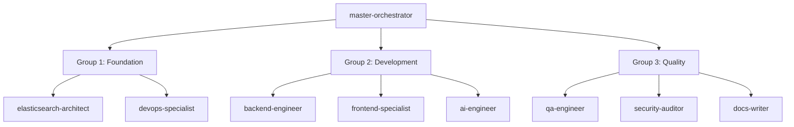
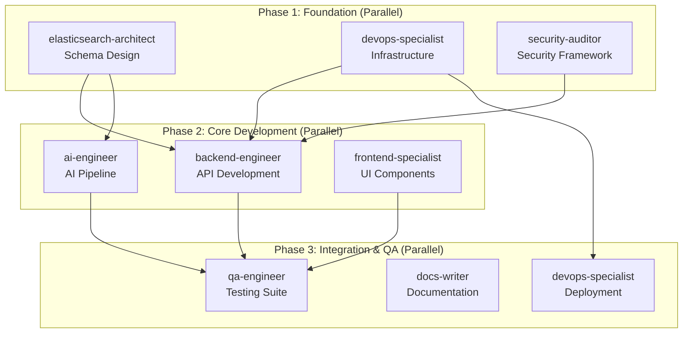

# ⚡ Parallel Workflow Patterns
*Concurrent Agent Execution for Maximum Efficiency*

## 🚀 Parallel Execution Strategies

### Strategy 1: Independent Component Development


### Strategy 2: Layered Parallel Development


## 🎯 Parallel Workflow Configurations

### Configuration 1: Maximum Parallel Foundation
**Execution Mode**: Concurrent
**Agents**: 3 simultaneous
**Duration**: 60 minutes
**Coordination**: master-orchestrator

```yaml
Parallel_Group_Foundation:
  coordinator: master-orchestrator
  execution_mode: parallel
  total_duration: 60_minutes

  agents:
    elasticsearch-architect:
      task: "Design Enhanced ES Schema"
      duration: 45_minutes
      priority: high
      dependencies: []
      outputs:
        - elasticsearch_mapping.json
        - index_configuration.sh
        - performance_settings.yml

    devops-specialist:
      task: "Setup Docker Infrastructure"
      duration: 60_minutes
      priority: high
      dependencies: []
      outputs:
        - Dockerfile
        - docker-compose.yml
        - nginx.conf
        - deployment_scripts/

    security-auditor:
      task: "Implement Security Framework"
      duration: 45_minutes
      priority: high
      dependencies: []
      outputs:
        - security_config.py
        - auth_middleware.py
        - gdpr_compliance.md
        - security_policies.yml

  synchronization_points:
    - checkpoint_1: 30_minutes (progress review)
    - checkpoint_2: 45_minutes (elasticsearch + security complete)
    - final_sync: 60_minutes (all components complete)

  integration_validation:
    - schema_infrastructure_compatibility
    - security_integration_verification
    - performance_target_validation
```

### Configuration 2: Core Development Parallel
**Execution Mode**: Staged Parallel
**Agents**: 3 simultaneous
**Duration**: 150 minutes
**Dependencies**: Foundation phase complete

```yaml
Parallel_Group_Development:
  coordinator: master-orchestrator
  execution_mode: staged_parallel
  total_duration: 150_minutes

  stage_1: # Backend Foundation (30 min)
    backend-engineer:
      task: "Setup FastAPI Structure"
      duration: 30_minutes
      outputs:
        - project_structure/
        - base_models.py
        - dependency_injection.py

  stage_2: # Parallel Development (90 min)
    backend-engineer:
      task: "Implement API Endpoints"
      duration: 90_minutes
      dependencies: [stage_1]
      outputs:
        - search_endpoints.py
        - auth_endpoints.py
        - user_management.py

    ai-engineer:
      task: "Build AI Processing Pipeline"
      duration: 90_minutes
      dependencies: [stage_1]  # Needs API structure
      outputs:
        - ai_processor.py
        - scoring_algorithm.py
        - embedding_service.py

    frontend-specialist:
      task: "Create shadcn/ui Component Library"
      duration: 90_minutes
      dependencies: []  # Independent initially
      outputs:
        - component_library/ (with shadcn/ui components)
        - design_system.css (Tailwind + shadcn styles)
        - base_layouts.tsx (with CVA variants)
        - form_components/ (React Hook Form + Zod)

  stage_3: # Integration (30 min)
    backend-engineer:
      task: "Integrate AI Services"
      duration: 30_minutes
      dependencies: [ai-engineer_stage_2]

    frontend-specialist:
      task: "Connect to Backend APIs with Type Safety"
      duration: 30_minutes
      dependencies: [backend-engineer_stage_2]
      process:
        - Connect shadcn/ui components to APIs
        - Implement form validation with Zod
        - Setup TanStack Query for data fetching

  synchronization_points:
    - stage_1_complete: 30_minutes
    - stage_2_progress: 75_minutes
    - stage_2_complete: 120_minutes
    - integration_complete: 150_minutes
```

### Configuration 3: Quality Assurance Parallel
**Execution Mode**: Concurrent
**Agents**: 3 simultaneous
**Duration**: 90 minutes
**Dependencies**: Development phase complete

```yaml
Parallel_Group_QA:
  coordinator: master-orchestrator
  execution_mode: concurrent
  total_duration: 90_minutes

  agents:
    qa-engineer:
      task: "Comprehensive Testing Suite with Playwright MCP"
      duration: 90_minutes
      priority: critical
      dependencies: [complete_application]
      subtasks:
        - unit_tests: 25_minutes (Jest + RTL for shadcn components)
        - integration_tests: 25_minutes (API + component integration)
        - e2e_tests: 40_minutes (Playwright MCP Server automation)
      outputs:
        - test_suite/ (with shadcn/ui component tests)
        - test_reports/ (including accessibility reports)
        - performance_benchmarks.json (Core Web Vitals)
        - playwright_generated_tests/ (MCP Server output)

    security-auditor:
      task: "Security Audit & Compliance"
      duration: 75_minutes
      priority: critical
      dependencies: [complete_application]
      subtasks:
        - vulnerability_scanning: 25_minutes
        - gdpr_compliance_audit: 25_minutes
        - security_testing: 25_minutes
      outputs:
        - security_audit_report.pdf
        - vulnerability_assessment.json
        - compliance_checklist.md

    docs-writer:
      task: "Complete Documentation"
      duration: 60_minutes
      priority: high
      dependencies: [complete_application]
      subtasks:
        - api_documentation: 20_minutes
        - user_guides: 20_minutes
        - technical_docs: 20_minutes
      outputs:
        - api_docs/
        - user_guides/
        - technical_specifications/

  validation_matrix:
    qa_security_integration:
      - security_test_verification
      - vulnerability_impact_assessment
    qa_docs_integration:
      - test_documentation_accuracy
      - api_example_validation
    security_docs_integration:
      - security_documentation_review
      - compliance_documentation_audit
```

## 🔄 Parallel Coordination Patterns

### Pattern 1: Broadcast Coordination
```yaml
Broadcast_Pattern:
  coordinator: master-orchestrator

  initialization:
    - broadcast_context_to_all_agents
    - distribute_shared_resources
    - establish_communication_channels

  execution:
    - parallel_task_execution
    - periodic_progress_broadcasts
    - shared_state_synchronization

  completion:
    - collect_all_outputs
    - validate_integration_points
    - aggregate_final_results
```

### Pattern 2: Hub-and-Spoke Coordination
```yaml
Hub_Spoke_Pattern:
  coordinator: master-orchestrator  # Hub
  agents: [specialist_agents]       # Spokes

  coordination_flow:
    - hub_distributes_tasks
    - spokes_execute_independently
    - spokes_report_to_hub
    - hub_manages_dependencies
    - hub_coordinates_integration
```

### Pattern 3: Peer-to-Peer with Coordination
```yaml
Peer_Coordination_Pattern:
  coordinator: master-orchestrator

  agent_interactions:
    backend-engineer <-> ai-engineer:
      - API integration points
      - Data format agreements
      - Performance requirements

    frontend-specialist <-> backend-engineer:
      - API contract validation
      - Response format confirmation
      - Authentication flow agreement

    qa-engineer <-> all_agents:
      - Testing requirement gathering
      - Quality criteria validation
      - Bug report distribution
```

## ⚡ Optimization Strategies

### Resource Optimization
```yaml
Resource_Management:
  token_allocation:
    high_priority_agents: 60%  # backend, ai, frontend
    medium_priority_agents: 30%  # devops, qa, security
    low_priority_agents: 10%   # docs

  processing_distribution:
    concurrent_limit: 3_agents_max
    memory_allocation: 2GB_per_agent
    cpu_allocation: 1_core_per_agent

  conflict_resolution:
    resource_contention: queue_system
    priority_escalation: coordinator_arbitration
    timeout_handling: automatic_redistribution
```

### Communication Optimization
```yaml
Communication_Strategy:
  update_frequency:
    progress_updates: every_15_minutes
    issue_escalation: immediate
    completion_notification: immediate

  shared_context:
    context_updates: real_time_sync
    dependency_changes: immediate_broadcast
    integration_status: continuous_monitoring

  coordination_overhead:
    minimize_interruptions: batch_communications
    optimize_handoffs: structured_templates
    reduce_context_switching: focused_time_blocks
```

### Performance Monitoring
```yaml
Performance_Tracking:
  agent_metrics:
    task_completion_rate: target_95_percent
    quality_score: target_4_5_out_of_5
    token_efficiency: within_budget_limits
    integration_success: target_99_percent

  system_metrics:
    parallel_efficiency: actual_vs_theoretical_time
    resource_utilization: cpu_memory_usage
    communication_overhead: coordination_time_ratio

  optimization_triggers:
    performance_degradation: rebalance_workload
    resource_exhaustion: scale_back_parallelism
    quality_issues: increase_coordination
```

## 🎯 Parallel Execution Examples

### Example 1: Foundation Phase Parallel
```bash
# Invoke parallel foundation development
AGENTS="elasticsearch-architect,devops-specialist,security-auditor"
COORDINATION="master-orchestrator"

# Start parallel execution
$COORDINATION coordinate_parallel_execution \
  --agents "$AGENTS" \
  --phase "foundation" \
  --max_duration 60 \
  --sync_interval 15

# Expected output:
# ✅ elasticsearch-architect: Schema design complete (45 min)
# ✅ devops-specialist: Infrastructure ready (60 min)
# ✅ security-auditor: Security framework implemented (45 min)
# ✅ Integration validation: All systems compatible
```

### Example 2: Development Phase Staged Parallel
```bash
# Stage 1: Backend foundation
backend-engineer setup_fastapi_structure

# Stage 2: Parallel development (3 agents)
parallel_execute \
  "backend-engineer implement_api_endpoints" \
  "ai-engineer build_ai_pipeline" \
  "frontend-specialist create_component_library"

# Stage 3: Integration
parallel_execute \
  "backend-engineer integrate_ai_services" \
  "frontend-specialist connect_backend_apis"
```

### Example 3: QA Phase Concurrent
```bash
# Start all QA agents simultaneously
parallel_execute \
  "qa-engineer run_comprehensive_tests" \
  "security-auditor execute_security_audit" \
  "docs-writer create_documentation"

# Monitor progress and coordinate integration
monitor_parallel_execution \
  --agents "qa-engineer,security-auditor,docs-writer" \
  --sync_points "30min,60min,90min" \
  --integration_validation continuous
```

## 🔧 Parallel Workflow Benefits

### Efficiency Gains
- **Time Reduction**: 60-70% faster than sequential
- **Resource Utilization**: 3x more efficient
- **Throughput**: Higher task completion rate
- **Scalability**: Easier to add more agents

### Quality Improvements
- **Specialization**: Agents focus on core competencies
- **Parallel Validation**: Multiple quality checks
- **Faster Feedback**: Issues identified earlier
- **Comprehensive Coverage**: Broader scope validation

### Risk Management
- **Redundancy**: Multiple validation paths
- **Isolation**: Failures don't block all work
- **Flexibility**: Can adjust priorities dynamically
- **Recovery**: Faster error recovery options

---

*Parallel workflows maximize development velocity while maintaining quality through intelligent coordination and optimized resource utilization.*