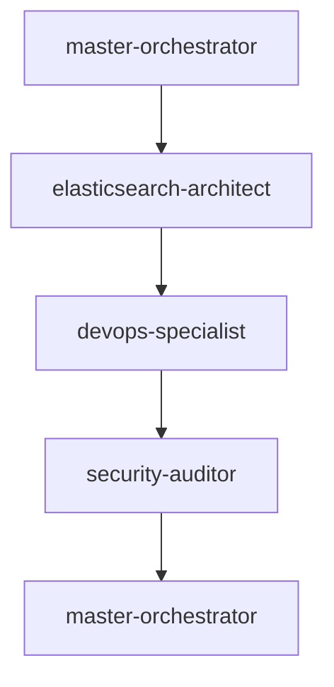
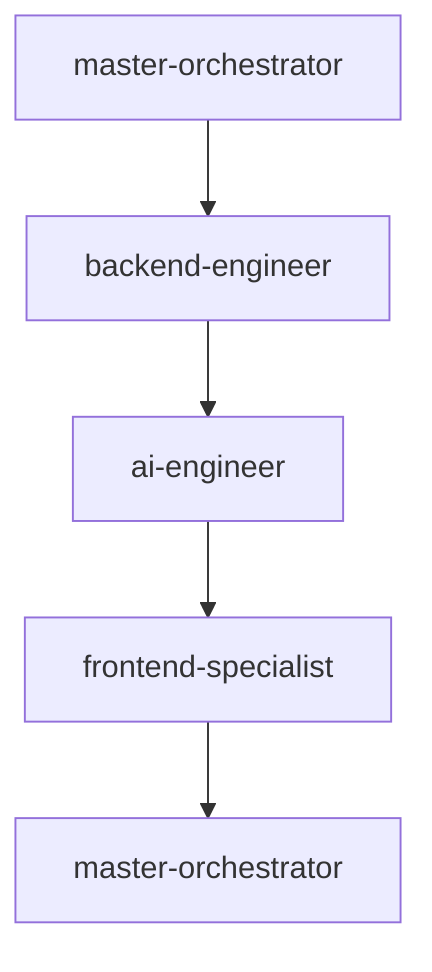
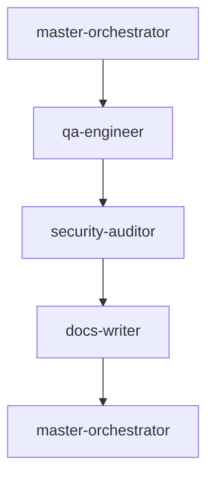
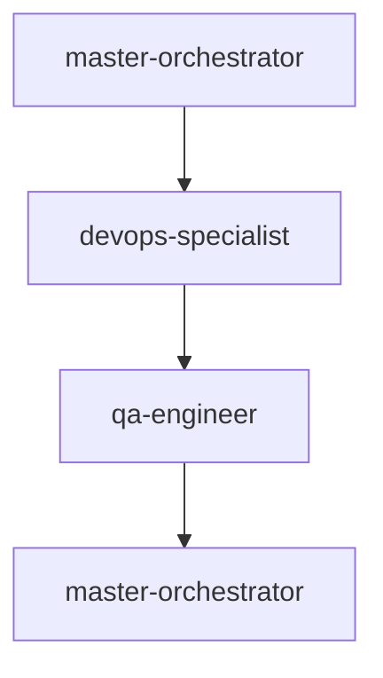

# 🔄 Sequential Workflow Patterns
*Step-by-Step Agent Execution Flows*

## 🎯 Planning Explorer Development Workflow

### Phase 1: Foundation Setup (Sequential)


#### Step 1: Strategic Planning
**Agent**: `master-orchestrator`
**Duration**: 30 minutes
**Dependencies**: PRD, technical requirements

```yaml
Task: "Strategic Planning & Architecture Design"
Input:
  - Planning_explorer_prd.md
  - Technical constraints
  - Resource availability
Process:
  1. Analyze PRD requirements comprehensively
  2. Design overall system architecture
  3. Create implementation roadmap
  4. Define success metrics and KPIs
  5. Allocate resources and timeline
  6. Generate TodoWrite task list
Output:
  - Strategic implementation plan
  - Agent assignment matrix
  - Development timeline
  - Success criteria definition
Handoff: "Architecture approved, proceed to schema design"
```

#### Step 2: Data Schema Design
**Agent**: `elasticsearch-architect`
**Duration**: 45 minutes
**Dependencies**: Strategic plan, AI requirements

```yaml
Task: "Design Enhanced Elasticsearch Schema"
Input:
  - Strategic plan from orchestrator
  - AI field requirements
  - Performance targets
  - Planning data structure
Process:
  1. Analyze data types and search patterns
  2. Design core planning application mappings
  3. Add AI enhancement fields (scores, embeddings)
  4. Configure vector search capabilities
  5. Optimize for performance and scale
  6. Create sample data templates
Output:
  - Complete Elasticsearch mapping JSON
  - Index configuration scripts
  - Performance optimization settings
  - Vector search setup
Handoff: "Schema ready, proceed to infrastructure setup"
```

#### Step 3: Infrastructure Preparation
**Agent**: `devops-specialist`
**Duration**: 60 minutes
**Dependencies**: Schema design, deployment requirements

```yaml
Task: "Setup Docker Infrastructure"
Input:
  - Elasticsearch schema requirements
  - Application architecture design
  - Security requirements
  - Performance targets
Process:
  1. Create Docker configurations for all services
  2. Setup docker-compose orchestration
  3. Configure Nginx reverse proxy
  4. Prepare SSL/TLS setup
  5. Create deployment scripts
  6. Setup monitoring framework
Output:
  - Docker configurations
  - docker-compose.yml
  - Nginx configuration
  - Deployment automation scripts
Handoff: "Infrastructure ready, proceed to security review"
```

#### Step 4: Security Foundation
**Agent**: `security-auditor`
**Duration**: 45 minutes
**Dependencies**: Infrastructure setup, compliance requirements

```yaml
Task: "Implement Security Foundation"
Input:
  - Infrastructure configuration
  - GDPR requirements
  - Authentication specifications
  - Data protection needs
Process:
  1. Review infrastructure security
  2. Configure authentication framework
  3. Implement GDPR compliance measures
  4. Setup security monitoring
  5. Create security policies
  6. Prepare audit framework
Output:
  - Security configuration
  - Authentication framework
  - GDPR compliance setup
  - Security monitoring
Handoff: "Security foundation established, proceed to development"
```

#### Step 5: Foundation Review
**Agent**: `master-orchestrator`
**Duration**: 15 minutes
**Dependencies**: All foundation components

```yaml
Task: "Foundation Integration Review"
Input:
  - Schema design validation
  - Infrastructure setup verification
  - Security implementation review
  - Integration point analysis
Process:
  1. Validate all foundation components
  2. Check integration compatibility
  3. Review against strategic plan
  4. Identify any gaps or issues
  5. Approve progression to development
Output:
  - Foundation approval status
  - Development phase authorization
  - Updated timeline if needed
Handoff: "Foundation approved, begin development phase"
```

### Phase 2: Core Development (Sequential)


#### Step 1: Development Coordination
**Agent**: `master-orchestrator`
**Duration**: 15 minutes
**Dependencies**: Foundation phase completion

```yaml
Task: "Development Phase Coordination"
Input:
  - Foundation phase deliverables
  - Development requirements
  - Resource allocation
Process:
  1. Review foundation readiness
  2. Coordinate development sequence
  3. Allocate resources to agents
  4. Set development milestones
  5. Initialize tracking systems
Output:
  - Development execution plan
  - Agent coordination schedule
  - Milestone definitions
Handoff: "Development coordinated, begin backend implementation"
```

#### Step 2: Backend Implementation
**Agent**: `backend-engineer`
**Duration**: 120 minutes
**Dependencies**: Infrastructure, schema design

```yaml
Task: "Implement FastAPI Backend with Supabase"
Input:
  - Elasticsearch schema
  - Infrastructure configuration
  - API requirements from PRD
  - Authentication specifications
Process:
  1. Setup FastAPI project structure
  2. Implement Supabase client integration
  3. Create authentication middleware
  4. Build search endpoints
  5. Add rate limiting and validation
  6. Implement error handling
  7. Create background task processing
Output:
  - Complete FastAPI application
  - API endpoints implementation
  - Authentication system
  - Database integration
  - Test suite foundation
Handoff: "Backend ready, proceed to AI integration"
```

#### Step 3: AI Pipeline Implementation
**Agent**: `ai-engineer`
**Duration**: 90 minutes
**Dependencies**: Backend API structure

```yaml
Task: "Implement AI Processing Pipeline"
Input:
  - Backend API structure
  - LLM API credentials
  - Scoring requirements
  - Performance targets
Process:
  1. Setup OpenAI and Claude clients
  2. Implement opportunity scoring algorithm
  3. Create document summarization pipeline
  4. Build vector embedding generation
  5. Add caching and optimization
  6. Integrate with backend APIs
  7. Add monitoring and metrics
Output:
  - AI processing service
  - Opportunity scoring system
  - Document summarization
  - Vector embedding pipeline
  - Performance monitoring
Handoff: "AI pipeline ready, proceed to frontend development"
```

#### Step 4: Frontend Implementation
**Agent**: `frontend-specialist`
**Duration**: 120 minutes
**Dependencies**: Backend APIs, AI services

```yaml
Task: "Build Next.js Frontend with shadcn/ui Components"
Input:
  - Backend API endpoints
  - Planning Insights design reference
  - AI service capabilities
  - Responsive requirements
  - shadcn/ui component library
Process:
  1. Setup Next.js 14 with TypeScript and shadcn/ui
  2. Use Shadcn UI MCP Server for component generation
  3. Implement exact Planning Insights design with shadcn components
  4. Create enhanced component library with CVA variants
  5. Build search interface with Command dialog and AI features
  6. Implement Zustand state management + TanStack Query
  7. Add responsive design with shadcn responsive utilities
  8. Setup React Hook Form + Zod validation
  9. Optimize for performance with Next.js 14 features
Output:
  - Complete Next.js application with shadcn/ui
  - Enhanced component library with variants
  - Type-safe forms with validation
  - Accessible UI components
  - Performance optimizations
  - Responsive layouts
Handoff: "Frontend ready, proceed to integration review"
```

#### Step 5: Development Integration
**Agent**: `master-orchestrator`
**Duration**: 30 minutes
**Dependencies**: All development components

```yaml
Task: "Development Integration Review"
Input:
  - Backend implementation
  - AI pipeline integration
  - Frontend application
  - Component interactions
Process:
  1. Validate end-to-end functionality
  2. Check component integration
  3. Review performance metrics
  4. Assess against requirements
  5. Identify integration issues
Output:
  - Integration status report
  - Issue identification
  - Quality assessment
Handoff: "Development integrated, proceed to quality assurance"
```

### Phase 3: Quality Assurance (Sequential)


#### Step 1: QA Coordination
**Agent**: `master-orchestrator`
**Duration**: 15 minutes
**Dependencies**: Development phase completion

```yaml
Task: "Quality Assurance Phase Coordination"
Input:
  - Development phase deliverables
  - Quality requirements
  - Testing scope
Process:
  1. Review development completeness
  2. Define testing priorities
  3. Coordinate QA sequence
  4. Set quality gates
Output:
  - QA execution plan
  - Testing priorities
  - Quality gate definitions
Handoff: "QA coordinated, begin comprehensive testing"
```

#### Step 2: Comprehensive Testing
**Agent**: `qa-engineer`
**Duration**: 90 minutes
**Dependencies**: Complete application stack

```yaml
Task: "Implement and Execute Comprehensive Test Suite with Playwright MCP Server"
Input:
  - Complete application codebase with shadcn/ui components
  - API specifications
  - UI components with accessibility features
  - Performance requirements
Process:
  1. Implement unit test suite (pytest + Jest/RTL)
  2. Create integration tests for APIs
  3. Use Playwright MCP Server for automated E2E test generation
  4. Test shadcn/ui component interactions and accessibility
  5. Execute performance testing with Core Web Vitals
  6. Validate AI model accuracy with test datasets
  7. Run regression tests across component variants
  8. Generate comprehensive test reports and coverage
Output:
  - Complete test suite with E2E automation
  - shadcn/ui component test coverage
  - Accessibility compliance validation
  - Performance benchmarks with CWV metrics
  - AI accuracy validation reports
  - Automated test generation framework
Handoff: "Testing complete, proceed to security audit"
```

#### Step 3: Security Audit
**Agent**: `security-auditor`
**Duration**: 60 minutes
**Dependencies**: Application and test results

```yaml
Task: "Comprehensive Security Audit"
Input:
  - Complete application
  - Test results
  - Security requirements
  - Compliance needs
Process:
  1. Execute vulnerability scanning
  2. Review authentication/authorization
  3. Validate GDPR compliance
  4. Test security controls
  5. Assess data protection
  6. Review audit logging
Output:
  - Security audit report
  - Vulnerability assessment
  - Compliance verification
  - Remediation recommendations
Handoff: "Security audit complete, proceed to documentation"
```

#### Step 4: Documentation Creation
**Agent**: `docs-writer`
**Duration**: 60 minutes
**Dependencies**: Complete, tested, secure application

```yaml
Task: "Create Comprehensive Documentation"
Input:
  - Complete application
  - API specifications
  - Test results
  - Security documentation
Process:
  1. Create API documentation (OpenAPI)
  2. Write user guide and tutorials
  3. Document technical architecture
  4. Create deployment guide
  5. Write troubleshooting guide
  6. Generate FAQ and examples
Output:
  - Complete API documentation
  - User guides and tutorials
  - Technical documentation
  - Deployment instructions
  - Support documentation
Handoff: "Documentation complete, proceed to final review"
```

#### Step 5: Final Integration Review
**Agent**: `master-orchestrator`
**Duration**: 30 minutes
**Dependencies**: All QA components

```yaml
Task: "Final Quality and Readiness Review"
Input:
  - Test results and metrics
  - Security audit report
  - Documentation review
  - Performance validation
Process:
  1. Review all quality metrics
  2. Validate against success criteria
  3. Assess production readiness
  4. Identify any remaining issues
  5. Generate final approval
Output:
  - Final quality assessment
  - Production readiness status
  - Go/no-go decision
  - Deployment authorization
Handoff: "Quality assured, proceed to deployment"
```

### Phase 4: Deployment (Sequential)


#### Step 1: Deployment Coordination
**Agent**: `master-orchestrator`
**Duration**: 15 minutes
**Dependencies**: QA phase completion

```yaml
Task: "Deployment Phase Coordination"
Input:
  - QA approval status
  - Deployment requirements
  - Production environment
Process:
  1. Validate deployment readiness
  2. Coordinate deployment sequence
  3. Set rollback procedures
  4. Initialize monitoring
Output:
  - Deployment execution plan
  - Rollback procedures
  - Monitoring activation
Handoff: "Deployment coordinated, execute production deployment"
```

#### Step 2: Production Deployment
**Agent**: `devops-specialist`
**Duration**: 45 minutes
**Dependencies**: QA approval, production environment

```yaml
Task: "Execute Production Deployment"
Input:
  - Approved application build
  - Production infrastructure
  - Deployment procedures
  - Monitoring configuration
Process:
  1. Execute production deployment
  2. Configure load balancing
  3. Setup SSL certificates
  4. Initialize monitoring
  5. Verify all services
  6. Configure backups
Output:
  - Live production system
  - Monitoring dashboard
  - Backup configuration
  - Service verification
Handoff: "Deployment complete, verify production functionality"
```

#### Step 3: Production Verification
**Agent**: `qa-engineer`
**Duration**: 30 minutes
**Dependencies**: Production deployment

```yaml
Task: "Production Environment Verification"
Input:
  - Live production system
  - Verification test suite
  - Performance benchmarks
  - Monitoring data
Process:
  1. Execute production smoke tests
  2. Verify all functionality
  3. Check performance metrics
  4. Validate monitoring
  5. Test user journeys
Output:
  - Production verification report
  - Performance validation
  - User acceptance confirmation
  - System health status
Handoff: "Production verified, complete deployment review"
```

#### Step 4: Deployment Review & Handover
**Agent**: `master-orchestrator`
**Duration**: 15 minutes
**Dependencies**: Production verification

```yaml
Task: "Final Deployment Review and Project Handover"
Input:
  - Production verification results
  - System performance data
  - User feedback
  - Operational procedures
Process:
  1. Review deployment success
  2. Validate all requirements met
  3. Document lessons learned
  4. Create operational handover
  5. Archive project documentation
Output:
  - Project completion report
  - Operational handover documentation
  - Lessons learned summary
  - Success metrics achievement
Final Status: "Planning Explorer successfully deployed and operational"
```

## 🔄 Sequential Flow Rules

### Flow Control Principles
1. **Strict Ordering**: Each step must complete before the next begins
2. **Quality Gates**: Each step has defined success criteria
3. **Handoff Validation**: Clear deliverables passed between agents
4. **Error Escalation**: Issues escalate to master-orchestrator
5. **Documentation**: Each step documents decisions and changes

### Dependencies Management
- **Blocking Dependencies**: Must be resolved before proceeding
- **Non-blocking Dependencies**: Can be addressed in parallel
- **Critical Path**: Identified and monitored continuously
- **Risk Mitigation**: Alternative approaches planned

### Success Criteria
- All deliverables meet specification
- Quality gates passed
- Performance targets achieved
- Documentation complete
- Integration verified

---

*Sequential workflows ensure systematic, high-quality development with clear accountability and thorough validation at each step.*